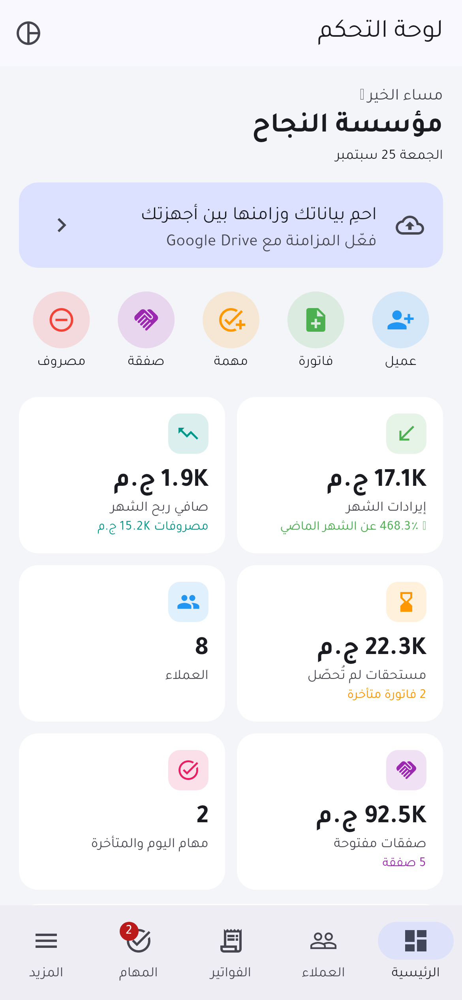
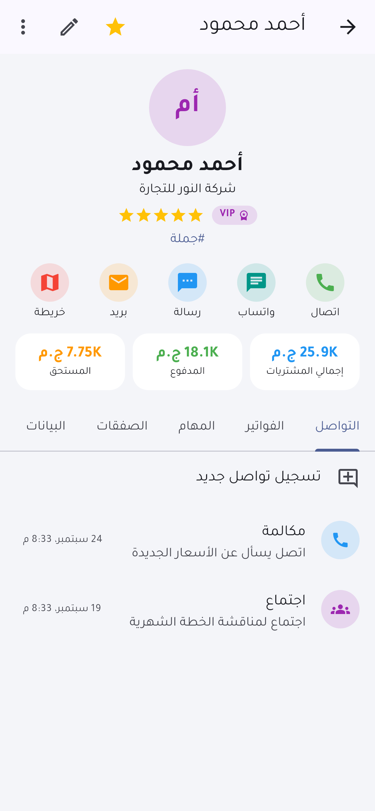
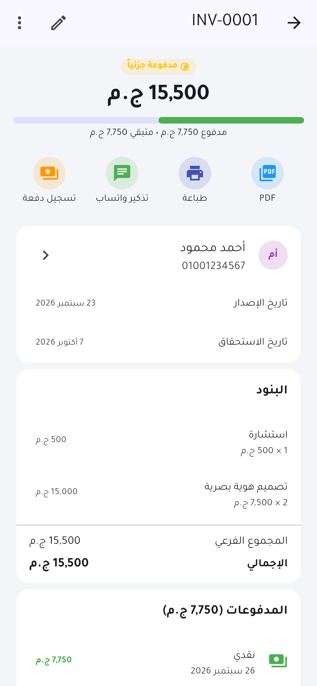
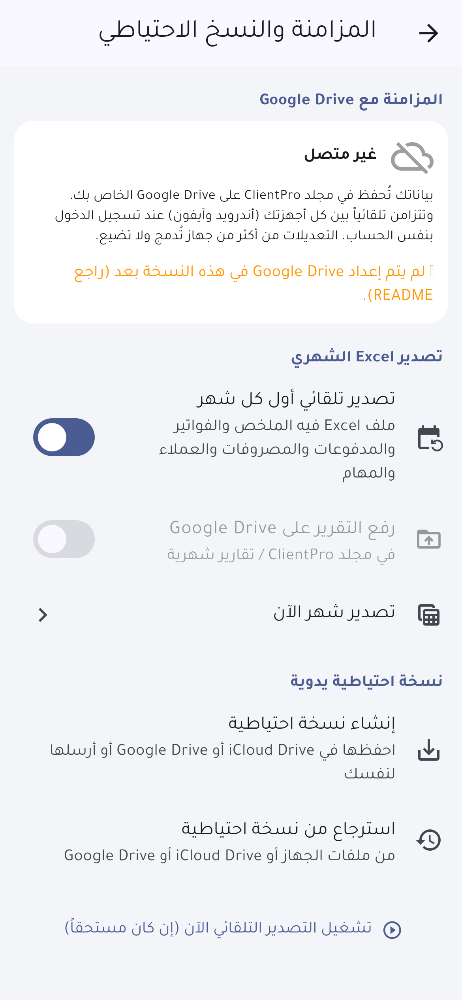

# ClientPro — تطبيق إدارة العملاء (أندرويد + آيفون)

تطبيق واحد بلغة Flutter يشتغل على **أندرويد وآيفون**، بالعربي بالكامل ومن اليمين لليسار، ومصمم بحيث تقدر تبيعه لعملائك وكل واحد يخصصه باسم نشاطه وشعاره وألوانه.

| الرئيسية | ملف العميل | الفاتورة | المزامنة |
|---|---|---|---|
|  |  |  |  |

## المميزات

- **لوحة التحكم:** إيرادات الشهر ونسبة النمو، صافي الربح، المستحقات، الصفقات المفتوحة، رسم بياني آخر ٦ شهور، هدف الشهر، مسار المبيعات، أفضل العملاء، مهام اليوم، الفواتير المتأخرة، المخزون المنخفض.
- **العملاء:** ملف كامل (وسوم، تقييم، مصدر، تاريخ ميلاد، **حقول مخصصة**)، بحث وفلترة وترتيب، اتصال / واتساب / SMS / بريد / خريطة بضغطة، سجل التواصل مع تذكير متابعة.
- **الفواتير:** بنود وخصم وضريبة، مسودة / إصدار / إلغاء، دفعات جزئية (نقدي، InstaPay، محفظة، تحويل...)، **PDF عربي بشعارك**، طباعة، تذكير على واتساب، نسخ الفاتورة، خصم تلقائي من المخزون.
- **الصفقات:** مسار مبيعات من أول تواصل لحد الإغلاق، احتمالية وقيمة مرجّحة، نسبة النجاح، وتحويل الصفقة المكسوبة لفاتورة.
- **المهام والتذكيرات:** مواعيد، أولويات، **تكرار يومي / أسبوعي / شهري / سنوي**، تأجيل بسحبة.
- **الإشعارات:**
  - تذكير بكل مهمة في موعدها.
  - فاتورة تستحق غداً، مستحقة اليوم، ومتأخرة أسبوع.
  - أعياد ميلاد العملاء.
  - ملخص يومي في الوقت اللي تختاره.
  - تذكير أول كل شهر بتصدير التقرير.
- **المزامنة مع Google Drive:** البيانات تتزامن تلقائياً بين كل أجهزتك (أندرويد وآيفون) على حساب Google بتاعك. لو عدّلت من جهازين، التعديلات بتتدمج ومفيش حاجة بتضيع، والمحذوف بيتحذف من كل الأجهزة.
- **تصدير Excel كل شهر:** أول كل شهر التطبيق بيعمل ملف Excel لبيانات الشهر اللي فات، فيه الملخص والفواتير والمدفوعات والمصروفات والعملاء والمهام، ويرفعه على Drive في فولدر `ClientPro/تقارير شهرية` ويبعتلك إشعار. وتقدر تصدّر أي شهر يدوياً.
- **نسخة احتياطية يدوية:** ملف تحفظه في **iCloud Drive** أو Google Drive أو تبعته لنفسك، واسترجاع منه بالدمج أو الاستبدال.
- **التقارير:** حسب الفترة: المحصّل، المصروفات، صافي الربح، متوسط الفاتورة، أعلى العملاء، أكثر المنتجات مبيعاً، توزيع المصروفات، مصادر العملاء.
- **المنتجات والمصروفات:** أسعار وتكلفة وهامش ربح ومخزون، ومصروفات بالتصنيف.
- **الإعدادات:** اسم النشاط وشعاره، ١٤ عملة، ترقيم الفواتير، الضريبة، الوضع الفاتح والداكن، ٩ ألوان، أرقام عربية أو إنجليزية، **قفل بالبصمة / Face ID**.

## أسهل طريقة تجرّب بيها على أندرويد

كل مرة يترفع كود على GitHub، الـ Build بيتعمل لوحده:

1. افتح صفحة المشروع على GitHub وادخل على **Actions** ثم **Build**.
2. افتح آخر تشغيل، ونزّل **ClientPro-android-apk** من قسم Artifacts.
3. انقل ملف الـ APK للموبايل وسطّبه (هيطلب منك تسمح بالتثبيت من مصادر غير معروفة).

## التشغيل من الكمبيوتر

المطلوب: [Flutter](https://docs.flutter.dev/get-started/install) نسخة 3.47 أو أحدث.

```bash
flutter pub get
flutter run            # على موبايل موصّل أو محاكي
flutter build apk      # ملف APK لأندرويد
```

**للآيفون:** لازم جهاز Mac عليه Xcode وحساب Apple.
1. افتح `ios/Runner.xcworkspace`.
2. اختار الـ Team من **Signing & Capabilities**.
3. شغّل التطبيق على الآيفون.

## ربط Google Drive (مرة واحدة)

التطبيق شغال كويس من غير ربط، لكن المزامنة ورفع التقارير على Drive محتاجين الخطوات دي من [Google Cloud Console](https://console.cloud.google.com/):

1. اعمل مشروع جديد، وفعّل منه **Google Drive API**.
2. من **OAuth consent screen** اعمل الإعداد (External)، وضيف الصلاحية `.../auth/drive.file`. دي صلاحية بتخلي التطبيق يشوف الملفات اللي هو عملها بس.
3. من **Credentials** اعمل 3 أنواع OAuth Client IDs:
   - **Web application:** ده اللي هتحطه في `GOOGLE_WEB_CLIENT_ID`.
   - **Android:** بالـ package `com.clientpro.clientpro` وبصمة الـ SHA-1 بتاعة مفتاح التوقيع. تجيبها بالأمر `cd android && ./gradlew signingReport`.
   - **iOS:** بالـ Bundle ID. ده اللي هتحطه في `GOOGLE_IOS_CLIENT_ID`.
4. في `ios/Runner/Info.plist` بدّل `YOUR_IOS_CLIENT_ID` بالـ iOS client ID (في المكانين).
5. شغّل أو اعمل Build بالمفاتيح:
   ```bash
   flutter run --dart-define=GOOGLE_WEB_CLIENT_ID=xxx.apps.googleusercontent.com \
               --dart-define=GOOGLE_IOS_CLIENT_ID=yyy.apps.googleusercontent.com
   ```
   وعشان الـ Build التلقائي على GitHub يستخدمهم، ضيفهم كـ **Secrets** في المستودع بنفس الأسماء.

كل عميل بيسجّل دخول بحساب Google الخاص بيه، وبياناته بتتحفظ في Drive بتاعه هو، مش عندك.

> **iCloud:** مفيش طريقة iCloud تشتغل على أندرويد، عشان كده المزامنة التلقائية بين النظامين بتتم عن طريق Google Drive، وده شغال على الآيفون كمان. على الآيفون تقدر تحفظ النسخة الاحتياطية والتقارير في iCloud Drive من زرار المشاركة. وملفات التطبيق كمان بتظهر في تطبيق **الملفات (Files)** على الآيفون.

## تخصيص التطبيق لكل عميل

- **الاسم تحت الأيقونة:**
  - أندرويد: `android:label` في `android/app/src/main/AndroidManifest.xml`.
  - آيفون: `CFBundleDisplayName` في `ios/Runner/Info.plist`.
- **الأيقونة:** بدّل `assets/icon/icon.png` وملفات `ic_launcher.png` و `AppIcon.appiconset`.
- **معرّف التطبيق:** قبل النشر في المتاجر غيّر `applicationId` في `android/app/build.gradle.kts` والـ Bundle ID في Xcode.
- **اسم النشاط والشعار والألوان والعملة:** العميل بيغيرها بنفسه من جوه التطبيق.

## هيكل المشروع

```
lib/
├── models/      نماذج البيانات (عميل، صفقة، فاتورة، منتج، مهمة، تواصل، مصروف)
├── data/        التخزين المحلي + دمج المزامنة، إعدادات الجهاز، بيانات تجريبية
├── services/    Google Drive، الإشعارات، Excel والنسخ الاحتياطي، PDF، واتساب والاتصال
└── ui/          الشاشات والعناصر المشتركة
test/            اختبارات (دمج المزامنة، الإشعارات، Excel، PDF، كل الشاشات)
```

## الاختبارات

```bash
flutter analyze
flutter test
# صور للشاشات في test/goldens:
flutter test test/screenshots_test.dart --update-goldens --run-skipped
```
