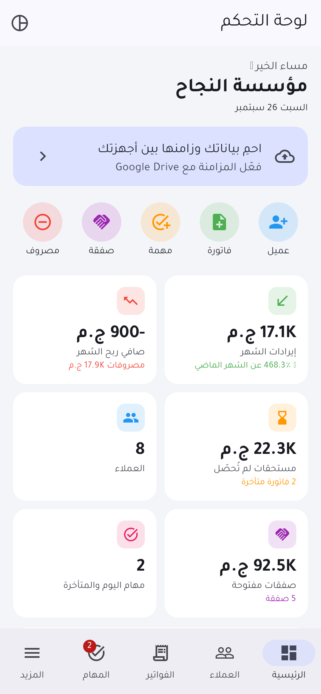
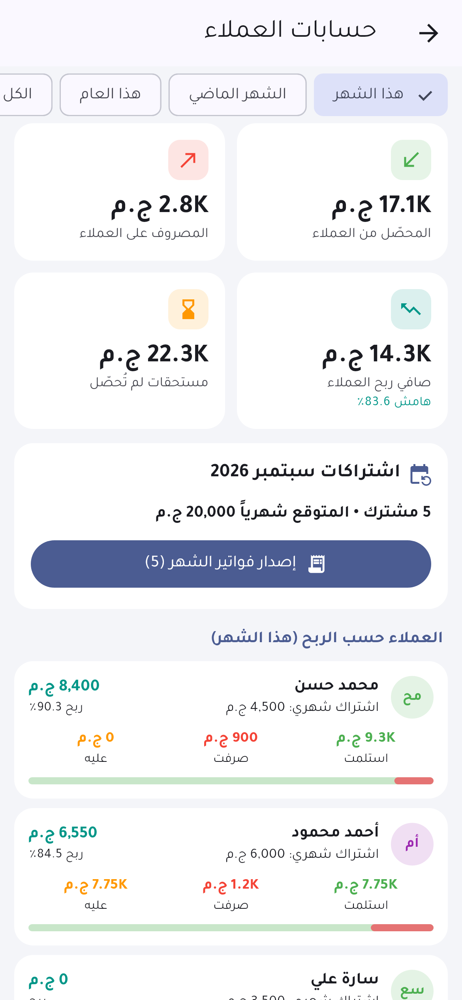
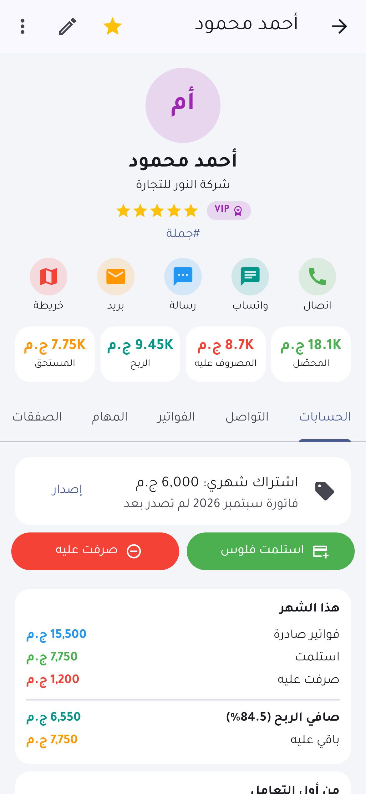
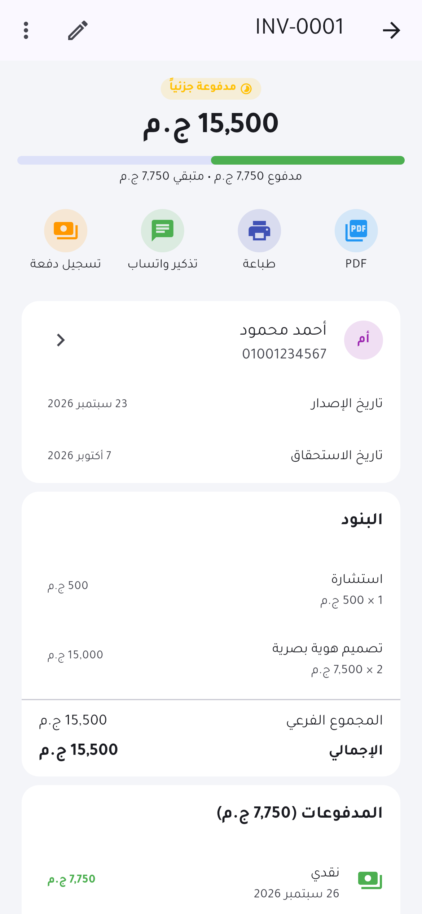
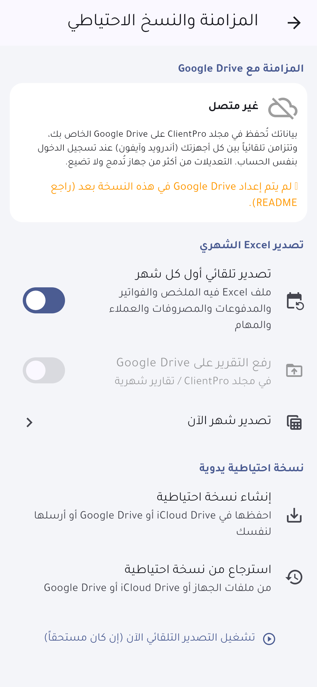

# ClientPro — تطبيق إدارة العملاء (أندرويد + آيفون)

تطبيق واحد بلغة Flutter يشتغل على **أندرويد وآيفون**، بالعربي بالكامل ومن اليمين لليسار، ومصمم بحيث تقدر تبيعه لعملائك وكل واحد يخصصه باسم نشاطه وشعاره وألوانه.

| الرئيسية | حسابات العملاء | ملف العميل | الفاتورة | المزامنة |
|---|---|---|---|---|
|  |  |  |  |  |

## المميزات

- **مصمم لحسابات عملاء الشركات والجهات** (مستشفيات، عيادات، معامل تحاليل، مراكز طبية…):
  - ملف كل عميل فيه: القطاع، الفرع، المسؤول ووظيفته، بداية ونهاية التعاقد، والخدمات المتفق عليها.
  - **تخصيص الخانات:** بتكتب قوايمك بنفسك (القطاعات، أنواع المصروفات، الخدمات)، وبتحدد خانات إضافية تظهر فاضية في ملف كل عميل وتملاها أنت.
  - تنبيه قبل نهاية أي عقد بأسبوعين، وقبلها بـ 3 أيام، ويوم الانتهاء.
- **حسابات كل عميل:**
  - سعر لكل عميل: اشتراك شهري أو مبلغ مرة واحدة.
  - زرار **"استلمت فلوس"**: بيسدد الفواتير المفتوحة الأول، والباقي بيتسجل دفعة جديدة.
  - زرار **"صرفت عليه"**: مصروف مربوط بالعميل، زي الإعلانات أو الفريلانسر.
  - لكل عميل: استلمت كام، صرفت كام، صافي الربح ونسبته، وباقي عليه كام، مع سجل بكل الحركات.
  - شاشة **حسابات العملاء**: كل العملاء مترتبين حسب الربح، بفلتر للشهر أو الشهر الماضي أو السنة أو الكل.
  - زرار **"إصدار فواتير الشهر"** للمشتركين كلهم مرة واحدة، مع قائمة باللي لسه ما دفعوش.

- **لوحة التحكم:** إيرادات الشهر ونسبة النمو، صافي الربح، المستحقات، الصفقات المفتوحة، رسم بياني آخر ٦ شهور، هدف الشهر، مسار المبيعات، أفضل العملاء، مهام اليوم، الفواتير المتأخرة، المخزون المنخفض.
- **العملاء:** ملف كامل (وسوم، تقييم، مصدر، تاريخ ميلاد، **حقول مخصصة**)، بحث وفلترة وترتيب، اتصال / واتساب / SMS / بريد / خريطة بضغطة، سجل التواصل مع تذكير متابعة.
- **الفواتير:** بنود وخصم وضريبة، مسودة / إصدار / إلغاء، دفعات جزئية (نقدي، InstaPay، محفظة، تحويل...)، **PDF عربي بشعارك**، طباعة، تذكير على واتساب، نسخ الفاتورة، خصم تلقائي من المخزون.
- **الصفقات:** مسار مبيعات من أول تواصل لحد الإغلاق، احتمالية وقيمة مرجّحة، نسبة النجاح، وتحويل الصفقة المكسوبة لفاتورة.
- **المهام والتذكيرات:** مواعيد، أولويات، **تكرار يومي / أسبوعي / شهري / سنوي**، تأجيل بسحبة.
- **الإشعارات:**
  - تذكير بكل مهمة في موعدها.
  - فاتورة تستحق غداً، مستحقة اليوم، ومتأخرة أسبوع.
  - أعياد ميلاد العملاء.
  - ملخص يومي في الوقت اللي تختاره.
  - تذكير أول كل شهر بتصدير التقرير.
- **المزامنة مع Google Drive:** البيانات تتزامن تلقائياً بين كل أجهزتك (أندرويد وآيفون) على حساب Google بتاعك. لو عدّلت من جهازين، التعديلات بتتدمج ومفيش حاجة بتضيع، والمحذوف بيتحذف من كل الأجهزة.
- **تصدير Excel كل شهر:** أول كل شهر التطبيق بيعمل ملف Excel لبيانات الشهر اللي فات، فيه الملخص والفواتير والمدفوعات والمصروفات والعملاء والمهام، ويرفعه على Drive في فولدر `ClientPro/تقارير شهرية` ويبعتلك إشعار. وتقدر تصدّر أي شهر يدوياً.
- **نسخة احتياطية يدوية:** ملف تحفظه في **iCloud Drive** أو Google Drive أو تبعته لنفسك، واسترجاع منه بالدمج أو الاستبدال.
- **التقارير:** حسب الفترة: المحصّل، المصروفات، صافي الربح، متوسط الفاتورة، أعلى العملاء، أكثر المنتجات مبيعاً، توزيع المصروفات، مصادر العملاء.
- **المنتجات والمصروفات:** أسعار وتكلفة وهامش ربح ومخزون، ومصروفات بالتصنيف.
- **الالتزامات والمتابعة (تاب لوحده):** في شاشة واحدة بتشوف كل شهر: المصاريف الثابتة، اتدفعت ولا لأ. المرتبات، مين اخد ومين لسه. **ليك فلوس عند مين** (عملاء عليهم فواتير + أي حد سلّفته). **وعليك فلوس لمين** (مورد، فريلانسر، قسط...)، مع دفعات جزئية وتذكير على واتساب. وبيجيلك **إشعار متابعة دوري** (كل يوم، كل يومين، كل ٣ أيام أو كل أسبوع، في الساعة اللي تختارها) فيه اللي ما اتدفعش ومين ما اخدش ومين عليه فلوس ومين ليه، وكمان إشعار يوم ميعاد كل دين وكل أسبوع بعده لحد ما يتقفل.
- **الموظفين والمرتبات:** بتضيف كل موظف بمرتبه ويوم قبضه، وتسجّل له خصم أو غياب (بحساب اليوم تلقائي) أو مكافأة أو إضافي أو سلفة. التطبيق يحسب الصافي، ولما تدوس "صرف كل المرتبات" بيتسجل مصروف مرتبات لكل واحد. السلفة بتتسجل مصروف وقتها وبتتخصم من مرتب الشهر. فيه كمان سجل القبض لكل موظف.
- **المصاريف الثابتة:** الإيجار والكهرباء والمياه والغاز والإنترنت والتليفون والاشتراكات والتأمينات وأي بند تضيفه، بمبلغ ثابت أو متغير (زي الكهرباء، بيسألك على المبلغ وقت الدفع). بيجيلك تذكير قبل الميعاد بيوم ويوم الميعاد، وتسجّل الشهر كله بضغطة. الداشبورد فيه كارت "التزامات الشهر" بيوضح اللي اتدفع واللي باقي، وملف Excel الشهري فيه شيت المرتبات وشيت المصاريف الثابتة.
- **الإعدادات:** اسم النشاط وشعاره، ١٤ عملة، ترقيم الفواتير، الضريبة، الوضع الفاتح والداكن، ٩ ألوان، أرقام عربية أو إنجليزية، **قفل بالبصمة / Face ID**.

## تحميل التطبيق جاهز

كل مرة يتحدّث الكود، النسخ الجاهزة بتتعمل لوحدها وبتتحط في صفحة واحدة:
**https://github.com/Minapotter55/test-1/releases/latest**

### أندرويد
1. من الموبايل افتح الرابط ده وهو هينزّل الملف على طول:
   https://github.com/Minapotter55/test-1/releases/latest/download/ClientPro.apk
2. افتح الملف اللي نزل. لو طلب إذن **"التثبيت من مصادر غير معروفة"**، وافق عليه.
3. اضغط **تثبيت**.

### آيفون
أبل مش بتسمح بتثبيت تطبيق مباشرة من غير App Store، فالطريقة المجانية كالتالي:
1. نزّل [Sideloadly](https://sideloadly.io) على الكمبيوتر (ويندوز أو ماك).
2. نزّل `ClientPro-unsigned.ipa` من صفحة الـ Release.
3. وصّل الآيفون بالكمبيوتر، اسحب الملف جوه Sideloadly، واكتب Apple ID بتاعك، وبعدين اضغط **Start**.
4. على الآيفون افتح **الإعدادات ← عام ← VPN وإدارة الجهاز**، واختار حسابك واضغط **ثقة**.

> بحساب Apple المجاني التطبيق بيشتغل **7 أيام** وبعدها لازم تعيد الخطوة 3، وبياناتك مش بتضيع. عشان تتخلص من ده وتقدر تبيعه لعملائك على الآيفون، لازم حساب **Apple Developer** (99 دولار في السنة)، وبعدها تنشره على TestFlight أو App Store.

### مفتاح توقيع ثابت للأندرويد (مهم قبل ما توزّع على عملاء)
من غير المفتاح ده، كل نسخة جديدة بتتوقّع بمفتاح مختلف، فأندرويد مش هيقبل التحديث فوق النسخة القديمة. هتضطر تمسح التطبيق الأول، فخلي بالك تاخد نسخة احتياطية أو تفعّل Drive قبلها. عشان تحل ده مرة واحدة:
1. اعمل مفتاح على أي جهاز متسطّب عليه Java:
   ```bash
   keytool -genkey -v -keystore release.jks -alias clientpro -keyalg RSA -keysize 2048 -validity 10000
   base64 -w0 release.jks > release.b64
   ```
2. في GitHub ادخل على **Settings ← Secrets and variables ← Actions** وضيف اتنين Secrets:
   - `ANDROID_KEYSTORE_BASE64`: وده محتوى ملف `release.b64`.
   - `ANDROID_KEYSTORE_PASSWORD`: وده الباسورد اللي اخترته.
3. **احتفظ بملف `release.jks` والباسورد في مكان آمن.** لو ضاعوا، مش هتقدر تحدّث التطبيق عند عملائك تاني.

## التشغيل من الكمبيوتر

المطلوب: [Flutter](https://docs.flutter.dev/get-started/install) نسخة 3.47 أو أحدث.

```bash
flutter pub get
flutter run            # على موبايل موصّل أو محاكي
flutter build apk      # ملف APK لأندرويد
```

**للآيفون:** لازم جهاز Mac عليه Xcode وحساب Apple.
1. افتح `ios/Runner.xcworkspace`.
2. اختار الـ Team من **Signing & Capabilities**.
3. شغّل التطبيق على الآيفون.

## ربط Google Drive (مرة واحدة)

التطبيق شغال كويس من غير ربط، لكن المزامنة ورفع التقارير على Drive محتاجين الخطوات دي من [Google Cloud Console](https://console.cloud.google.com/):

1. اعمل مشروع جديد، وفعّل منه **Google Drive API**.
2. من **OAuth consent screen** اعمل الإعداد (External)، وضيف الصلاحية `.../auth/drive.file`. دي صلاحية بتخلي التطبيق يشوف الملفات اللي هو عملها بس.
3. من **Credentials** اعمل 3 أنواع OAuth Client IDs:
   - **Web application:** ده اللي هتحطه في `GOOGLE_WEB_CLIENT_ID`.
   - **Android:** بالـ package `com.clientpro.clientpro` وبصمة الـ SHA-1 بتاعة مفتاح التوقيع. تجيبها بالأمر `cd android && ./gradlew signingReport`.
   - **iOS:** بالـ Bundle ID. ده اللي هتحطه في `GOOGLE_IOS_CLIENT_ID`.
4. في `ios/Runner/Info.plist` بدّل `YOUR_IOS_CLIENT_ID` بالـ iOS client ID (في المكانين).
5. شغّل أو اعمل Build بالمفاتيح:
   ```bash
   flutter run --dart-define=GOOGLE_WEB_CLIENT_ID=xxx.apps.googleusercontent.com \
               --dart-define=GOOGLE_IOS_CLIENT_ID=yyy.apps.googleusercontent.com
   ```
   وعشان الـ Build التلقائي على GitHub يستخدمهم، ضيفهم كـ **Secrets** في المستودع بنفس الأسماء.

كل عميل بيسجّل دخول بحساب Google الخاص بيه، وبياناته بتتحفظ في Drive بتاعه هو، مش عندك.

> **iCloud:** مفيش طريقة iCloud تشتغل على أندرويد، عشان كده المزامنة التلقائية بين النظامين بتتم عن طريق Google Drive، وده شغال على الآيفون كمان. على الآيفون تقدر تحفظ النسخة الاحتياطية والتقارير في iCloud Drive من زرار المشاركة. وملفات التطبيق كمان بتظهر في تطبيق **الملفات (Files)** على الآيفون.

## تخصيص التطبيق لكل عميل

- **الاسم تحت الأيقونة:**
  - أندرويد: `android:label` في `android/app/src/main/AndroidManifest.xml`.
  - آيفون: `CFBundleDisplayName` في `ios/Runner/Info.plist`.
- **الأيقونة:** بدّل `assets/icon/icon.png` وملفات `ic_launcher.png` و `AppIcon.appiconset`.
- **معرّف التطبيق:** قبل النشر في المتاجر غيّر `applicationId` في `android/app/build.gradle.kts` والـ Bundle ID في Xcode.
- **اسم النشاط والشعار والألوان والعملة:** العميل بيغيرها بنفسه من جوه التطبيق.

## هيكل المشروع

```
lib/
├── models/      نماذج البيانات (عميل، صفقة، فاتورة، منتج، مهمة، تواصل، مصروف)
├── data/        التخزين المحلي + دمج المزامنة، إعدادات الجهاز، بيانات تجريبية
├── services/    Google Drive، الإشعارات، Excel والنسخ الاحتياطي، PDF، واتساب والاتصال
└── ui/          الشاشات والعناصر المشتركة
test/            اختبارات (دمج المزامنة، الإشعارات، Excel، PDF، كل الشاشات)
```

## الاختبارات

```bash
flutter analyze
flutter test
# صور للشاشات في test/goldens:
flutter test test/screenshots_test.dart --update-goldens --run-skipped
```
